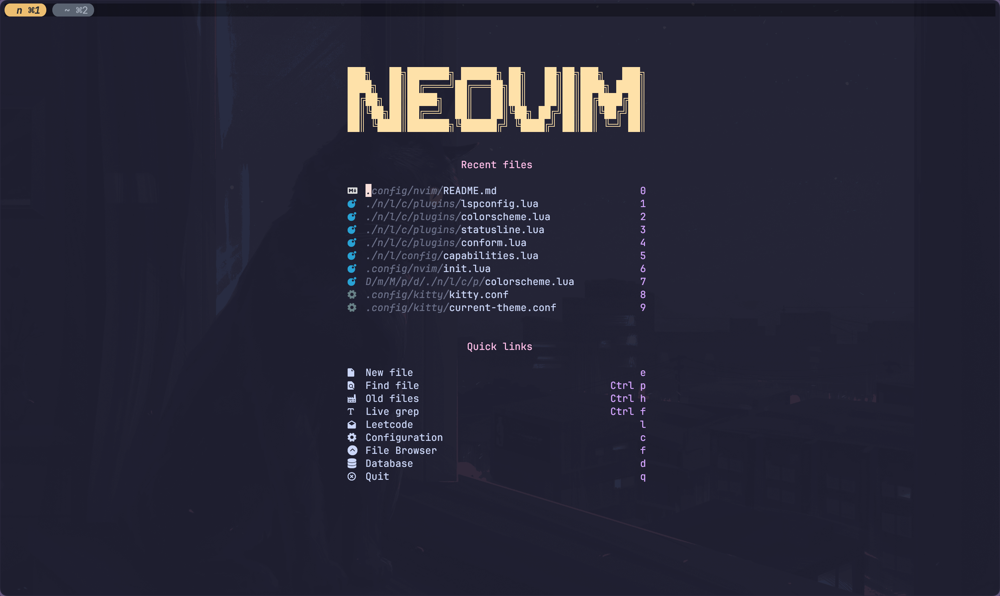

# User Guide


Install it

```console
git clone https://github.com/noahlias/nvim.git ~/.config/nvim
```

## Description

> [!WARNING]
>It's only for me to use, but you can use it if you want.
It's a simple neovim configuration with a dashboard and some plugins.
And the project structure is messy, I'm sorry for that.
Because it inherits from the repositories I referenced.

Maybe I can make it better in the future.

## Data science

There is a plugin `molten.nvim` for data science, you can use it to run python code in neovim.
But I choose the `vscode` to run jupyter notebook, because it's more convenient.

> [!NOTE]
> Choose the right tool for the right job.

## References

Referenced from the following repositories:

- [TheCW](https://github.com/theniceboy/nvim)
- [ofseed](https://github.com/ofseed/nvim/)
- [tjdevries](https://github.com/tjdevries/config_manager)
- [ThePrimeagen](https://github.com/ThePrimeagen/init.lua)
- [mini.nvim](https://github.com/echasnovski/mini.nvim)

They are all great resources to learn from.

> [!Note]
> If you have any suggestions or improvements, please let me know.

## License

MIT
