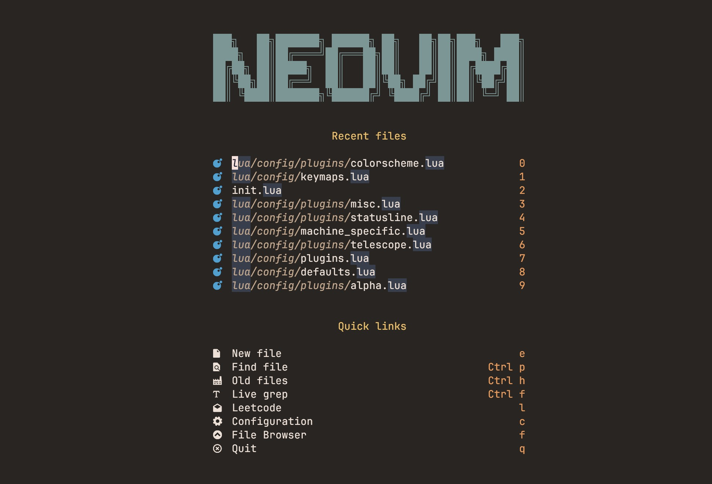

# User Guide



Install it

```bash
git clone https://github.com/noahlias/nvim.git ~/.config/nvim
```

# Plugins

Just dig into the lua/config/plugins.lua file to see the plugins that I use.

### nvim-surround

    Old text                    Command         New text
--------------------------------------------------------------------------------
    surr*ound_words             ysiw)           (surround_words)
    *make strings               ys$"            "make strings"
    [delete ar*ound me!]        ds]             delete around me!
    remove <b>HTML t*ags</b>    dst             remove HTML tags
    'change quot*es'            cs'"            "change quotes"
    <b>or tag* types</b>        csth1<CR>       <h1>or tag types</h1>
    delete(functi*on calls)     dsf             function calls

### mini.trailspace

    Command         Description
    <leader>mt      remove trailing spaces
    <leader>ms      trim_last_lines

### mini.splitjoin

    Command         Description
    gj              toggle split/join

## References

Referenced from the following repositories:

- [TheCW](https://github.com/theniceboy/nvim)
- [ofseed](https://github.com/ofseed/nvim/)
- [tjdevries](https://github.com/tjdevries/config_manager)
- [ThePrimeagen](https://github.com/ThePrimeagen/init.lua)
- [mini.nvim](https://github.com/echasnovski/mini.nvim)

They are all great resources to learn from.

## Performance

It seems some performance issues are present in the current configuration. I will try to fix them as soon as possible.

> [!Note]
> If you have any suggestions or improvements, please let me know.

## License

MIT
